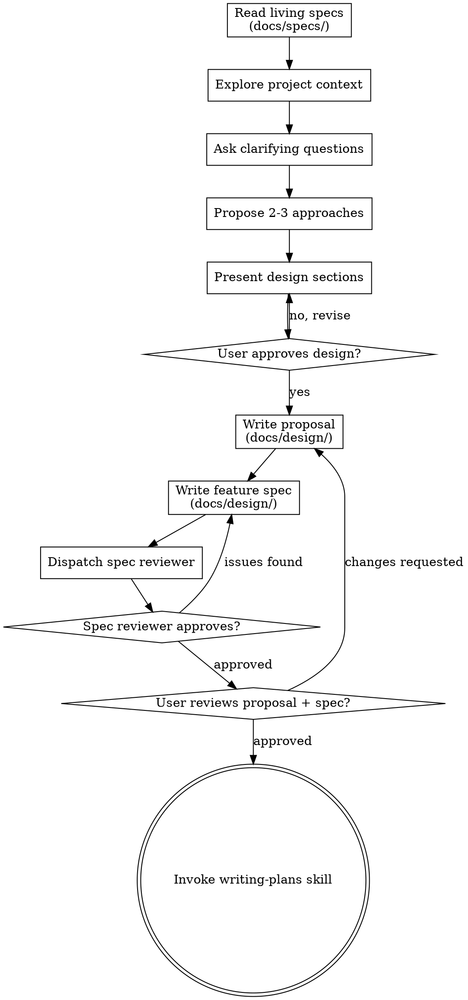

# Brainstorming Ideas Into Designs

Help turn ideas into fully formed proposals and specs through natural collaborative dialogue.

Start by understanding the current project context, then ask questions one at a time to refine the idea. Once you understand what you're building, present the design and get user approval. Then write the proposal and the feature spec — the behavioral contract that drives all downstream work.

<HARD-GATE>
Do NOT invoke any implementation skill, write any code, scaffold any project, or take any implementation action until you have written both the proposal and the feature spec, and the user has approved them. This applies to EVERY project regardless of perceived simplicity.
</HARD-GATE>

## Anti-Pattern: "This Is Too Simple To Need A Design"

Every project goes through this process. A todo list, a single-function utility, a config change — all of them. "Simple" projects are where unexamined assumptions cause the most wasted work. The proposal can be short (a few sentences for truly simple projects), but you MUST present it and get approval. The feature spec can be brief for simple changes, but it MUST exist as a separate artifact with behavioral requirements.

## Checklist

You MUST create a task for each of these items and complete them in order:

1. **Read living specs** — check `docs/specs/` for relevant domain specs. They describe current system behavior. If no spec exists for the relevant domain, note that the feature spec will define the domain's initial behavioral requirements.
2. **Explore project context** — check files, docs, recent commits
3. **Ask clarifying questions** — one at a time, understand purpose/constraints/success criteria
4. **Propose 2-3 approaches** — with trade-offs and your recommendation
5. **Present design** — in sections scaled to their complexity, get user approval after each section
6. **Write proposal** — save to `docs/design/YYYY-MM-DD-<topic>-proposal.md` and commit
7. **Write feature spec** — save to `docs/design/YYYY-MM-DD-<topic>-spec.md` and commit
8. **Dispatch spec reviewer** — use `spec-document-reviewer-prompt.md` to verify the spec is complete and behavioral
9. **User reviews proposal + spec** — ask user to review both artifacts before proceeding
10. **Transition to implementation** — invoke writing-plans skill to create implementation plan

## Process Flow



**The terminal state is invoking writing-plans.** Do NOT invoke any implementation skill directly. The ONLY skill you invoke after brainstorming is writing-plans.

## The Process

**Understanding the idea:**

- Read `docs/specs/<domain>.md` if it exists — it describes current system behavior for the relevant domain. If no spec exists for the domain, note that the feature spec will define the domain's initial behavioral requirements.
- Check out the current project state first (files, docs, recent commits)
- Before asking detailed questions, assess scope: if the request describes multiple independent subsystems (e.g., "build a platform with chat, file storage, billing, and analytics"), flag this immediately. Don't spend questions refining details of a project that needs to be decomposed first.
- If the project is too large for a single spec, help the user decompose into sub-projects: what are the independent pieces, how do they relate, what order should they be built? Then brainstorm the first sub-project through the normal design flow. Each sub-project gets its own proposal + spec → plan → implementation cycle.
- For appropriately-scoped projects, ask questions one at a time to refine the idea
- Prefer multiple choice questions when possible, but open-ended is fine too
- Only one question per message - if a topic needs more exploration, break it into multiple questions
- Focus on understanding: purpose, constraints, success criteria

**Exploring approaches:**

- Propose 2-3 different approaches with trade-offs
- Present options conversationally with your recommendation and reasoning
- Lead with your recommended option and explain why

**Presenting the design:**

- Once you believe you understand what you're building, present the design
- Scale each section to its complexity: a few sentences if straightforward, up to 200-300 words if nuanced
- Ask after each section whether it looks right so far
- Cover: architecture, components, data flow, error handling, testing
- Be ready to go back and clarify if something doesn't make sense

**Design for isolation and clarity:**

- Break the system into smaller units that each have one clear purpose, communicate through well-defined interfaces, and can be understood and tested independently
- For each unit, you should be able to answer: what does it do, how do you use it, and what does it depend on?
- Can someone understand what a unit does without reading its internals? Can you change the internals without breaking consumers? If not, the boundaries need work.
- Smaller, well-bounded units are also easier for you to work with - you reason better about code you can hold in context at once, and your edits are more reliable when files are focused. When a file grows large, that's often a signal that it's doing too much.

**Working in existing codebases:**

- Explore the current structure before proposing changes. Follow existing patterns.
- Where existing code has problems that affect the work (e.g., a file that's grown too large, unclear boundaries, tangled responsibilities), include targeted improvements as part of the design - the way a good developer improves code they're working in.
- Don't propose unrelated refactoring. Stay focused on what serves the current goal.

## After the Design

### Write the Proposal

The proposal captures **why** and **what scope**. Save to `docs/design/YYYY-MM-DD-<topic>-proposal.md` and commit.

```markdown
# Proposal: <Topic>

## Intent
<!-- Why are we doing this? What problem does it solve? Why now? -->

## Scope
**In scope:**
<!-- What this change covers -->

**Out of scope:**
<!-- What is explicitly excluded -->

## Approach
<!-- The recommended approach and why. Briefly note alternatives considered. -->

## Impact
<!-- Affected code, APIs, dependencies, systems -->
```

### Write the Feature Spec

The feature spec captures **what behavior** — the behavioral contract. This is the most important artifact from brainstorming. It drives the delta spec in writing-plans, the spec compliance review in implementation, and the living spec sync in finishing.

Save to `docs/design/YYYY-MM-DD-<topic>-spec.md` and commit.

```markdown
# Spec: <Topic>

## Domain: <domain-name>

### ADDED Requirements

#### Requirement: <requirement-name>
The system SHALL <behavioral description>.

##### Scenario: <scenario-name>
- GIVEN <precondition>
- WHEN <trigger>
- THEN <expected outcome>

### MODIFIED Requirements

#### Requirement: <existing-requirement-name>
<!-- Only the changed parts. The sync process preserves existing content. -->

##### Scenario: <new-or-changed-scenario>
- GIVEN <precondition>
- WHEN <trigger>
- THEN <expected outcome>

### REMOVED Requirements

#### Requirement: <deprecated-requirement-name>
(Brief explanation of why.)
```

**If modifying an existing domain** (living spec exists): Write ADDED/MODIFIED/REMOVED sections relative to the current living spec.

**If creating a new domain** (no living spec exists): Everything is ADDED. Write all behavioral requirements from scratch.

**If the change has no behavioral impact** (refactoring, internal restructure):

```markdown
# Spec: <Topic>

## No Behavioral Changes

<Brief description of the internal change.>
No requirements added, modified, or removed.
```

**Spec writing rules:**

- Every requirement MUST use RFC 2119 keywords (SHALL, MUST, SHOULD) — this is non-negotiable
- Every requirement MUST have at least one scenario with GIVEN/WHEN/THEN
- Scenarios MUST be testable — if you can't write a test for it, it's not a behavioral requirement
- Requirements describe WHAT the system does, not HOW — no class names, library choices, or implementation details
- If you find yourself writing "using [library]" or "in [class name]", that belongs in the proposal's Approach section, not the spec
- Keep requirement names descriptive and under 50 characters
- Use one `## Domain:` section per affected domain. If the feature touches multiple domains, add a section for each

### Dispatch Spec Reviewer

After writing the feature spec, dispatch a read-only subagent using `spec-document-reviewer-prompt.md` to verify the spec is complete and truly behavioral.

**If the reviewer finds issues:** Fix the spec, then re-dispatch the reviewer. Loop until the reviewer approves.

**Do NOT proceed to the user review gate until the spec reviewer approves.**

### User Review Gate

After the spec reviewer approves, ask the user to review both artifacts before proceeding:

> "Proposal written to `<proposal-path>` and feature spec written to `<spec-path>`. Please review both and let me know if you want to make any changes before we start writing the implementation plan."

Wait for the user's response. If they request changes, make them and re-run the spec reviewer, then re-present to the user. Only proceed once the user approves.

### Implementation

- Invoke the writing-plans skill to create a detailed implementation plan
- Do NOT invoke any other skill. writing-plans is the next step.

## Key Principles

- **One question at a time** - Don't overwhelm with multiple questions
- **Multiple choice preferred** - Easier to answer than open-ended when possible
- **YAGNI ruthlessly** - Remove unnecessary features from all designs
- **Explore alternatives** - Always propose 2-3 approaches before settling
- **Incremental validation** - Present design, get approval before moving on
- **Be flexible** - Go back and clarify when something doesn't make sense
- **Specs are behavioral contracts** - Requirements describe observable behavior, not implementation
