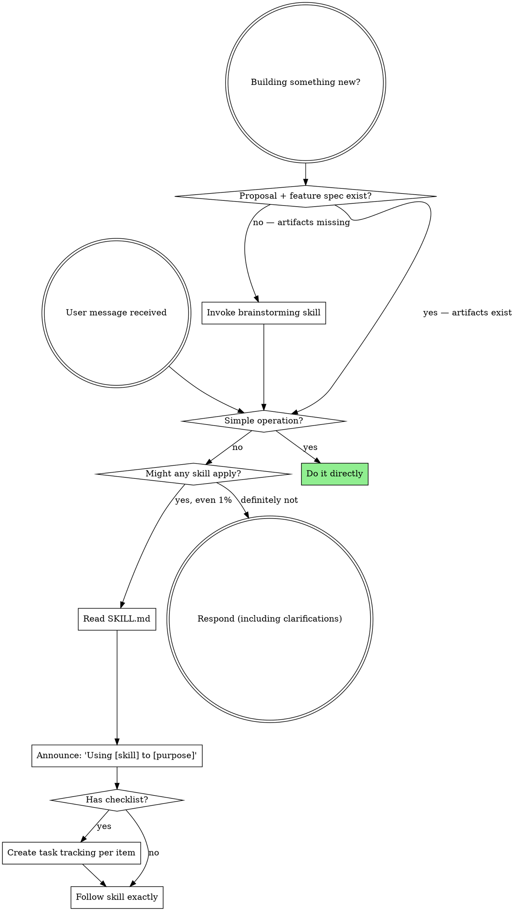

<SUBAGENT-STOP>
If you were dispatched as a subagent to execute a specific task, skip this skill.
</SUBAGENT-STOP>

<EXTREMELY-IMPORTANT>
If you think there is even a 1% chance a skill might apply to what you are doing, you ABSOLUTELY MUST invoke the skill.

IF A SKILL APPLIES TO YOUR TASK, YOU DO NOT HAVE A CHOICE. YOU MUST USE IT.

This is not negotiable. This is not optional. You cannot rationalize your way out of this.
</EXTREMELY-IMPORTANT>

## Simple Operations — No Skill Needed

DO NOT invoke skills or dispatch sub-agents for operations that are trivially fast and carry no risk of errors:

- Reading 1-3 files to understand code, configuration, or output
- Making a single edit to a file
- Running a simple command (ls, grep, find, git status, etc.)
- Answering a question based on information you already have
- Searching the codebase for a string or pattern
- Inspecting test output or error logs

These are tool calls, not tasks. Use them directly.

**Sub-agents are for work that is:**
- **Multi-step:** Requires 3+ distinct actions with judgment between them
- **Substantive:** Involves implementation, debugging, or design decisions
- **Risk-bearing:** Could introduce bugs if done incorrectly
- **Time-consuming:** Would take more than a handful of tool calls to complete

A sub-agent adds overhead (context construction, dispatch, result parsing). Only dispatch when the work justifies that cost.

## Instruction Priority

Superpowers skills override default system prompt behavior, but **user instructions always take precedence**:

1. **User's explicit instructions** (AGENTS.md, direct requests) — highest priority
2. **Superpowers skills** — override default system behavior where they conflict
3. **Default system prompt** — lowest priority

If AGENTS.md says "don't use TDD" and a skill says "always use TDD," follow the user's instructions. The user is in control.

## How Skills Work

Skills are auto-discovered and listed in your system prompt. When a skill applies, read its SKILL.md file and follow its instructions. Subagent dispatch is handled by the `Task` tool (see `references/pi-tools.md`).

# Using Skills

## The Rule

**Invoke relevant or requested skills BEFORE any response or action.** Even a 1% chance a skill might apply means that you should invoke the skill to check. If an invoked skill turns out to be wrong for the situation, you don't need to use it.

## Red Flags

These thoughts mean STOP—you're rationalizing:

| Thought | Reality |
|---------|---------|
| "I need more context first" | Skill check comes BEFORE clarifying questions. |
| "Let me gather information first" | Skills tell you HOW to gather information. |
| "This doesn't need a formal skill" | If a skill exists, use it. |
| "I remember this skill" | Skills evolve. Read current version. |
| "The skill is overkill" | Simple things become complex. Use it. |
| "I'll just do this one thing first" | Check BEFORE doing anything. |
| "This feels productive" | Undisciplined action wastes time. Skills prevent this. |
| "I know what that means" | Knowing the concept ≠ using the skill. Invoke it. |

**Exception:** The "Simple Operations" section above overrides these red flags.
Reading files, making small edits, or running quick commands is NOT rationalization —
it's the correct behavior. Only invoke skills when the work is substantive enough to
warrant a structured process.

## Skill Priority

When multiple skills could apply, use this order:

1. **Process skills first** (brainstorming, debugging) - these determine HOW to approach the task
2. **Implementation skills second** (domain-specific) - these guide execution

"Let's build X" → brainstorming first, then implementation skills.
"Fix this bug" → debugging first, then domain-specific skills.

**What counts as "already brainstormed":** The brainstorming skill has been completed when the proposal (`docs/design/YYYY-MM-DD-<topic>-proposal.md`) and the feature spec (`docs/design/YYYY-MM-DD-<topic>-spec.md`) both exist. A conversation about the idea is not the same as brainstorming. If the artifacts don't exist, invoke the brainstorming skill — even if you've already discussed the idea at length.

## Skill Types

**Rigid** (TDD, debugging): Follow exactly. Don't adapt away discipline.

**Flexible** (patterns): Adapt principles to context.

The skill itself tells you which.

## User Instructions

Instructions say WHAT, not HOW. "Add X" or "Fix Y" doesn't mean skip workflows.
